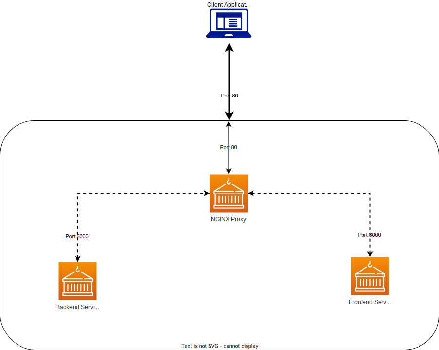

**Package Components:**

**Folder Structure:**

ROOT\
|\
|-flask-app\
|-----app.py\
|-----Dockerfile\
|-----wsgi.ini\
|-nginx-flask\
|-----Dockerfile\
|-----nginx.conf\
|-react-frontend\
|-----Dockerfile\
|-----sys-stats\
|---------(sys-stats deployment files)\
|-docker-compose.yaml

To build the full stack, execute docker-compose up --build within the ROOT folder.

**Exposed Endpoints:**

Nginx exposes two endpoints as follows:
1) / location used to service the main react frontend app
2) /stats loads the output from the backend service.

**Deployment Notes:**
- Node.js V16 Image was used due to incompatibilities present in V17 (latest tag) with OpenSSL 3.0 (https://github.com/webpack/webpack/issues/14532)
