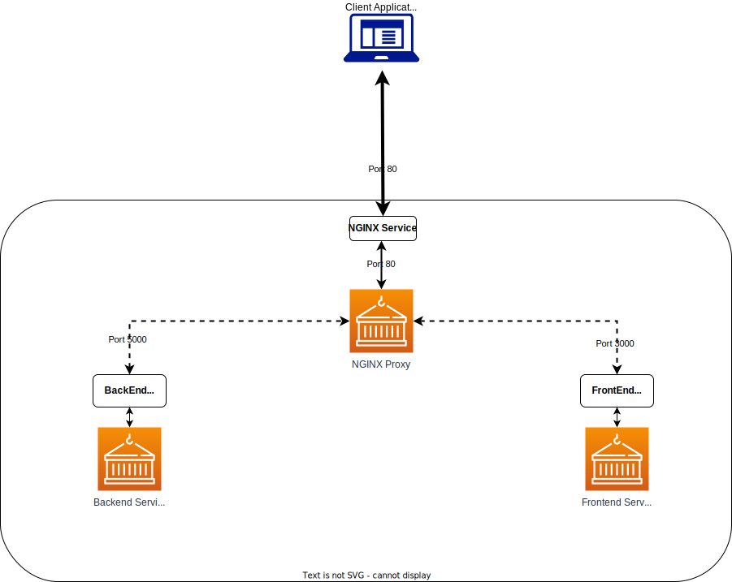

The docker images created as part of Task 1 were re-used in a kubernetes environment and form part of the YAML manifest file included with this repository.

The solution consists of 3 deployments and 3 service manifest definitions to build the solution in the image above. For networking and to allow inter-POD name resolution, services of type ClusterIP were created and associated with each deployment.

The YAML file can be deployed using the _kubectl create -f deployment.yml_ command
